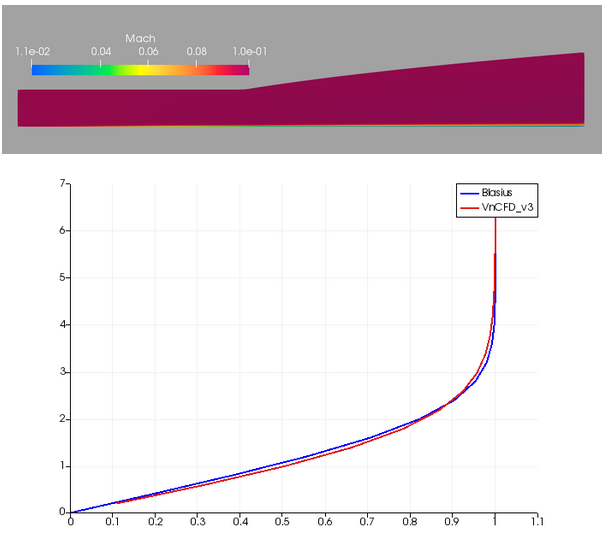

# CFD Notebook - Thực hành CFD với Python!

Phần 4 `Thực hành CFD với Python!` sẽ giới thiệu phương pháp giải hệ phương trình Navier-Stokes 2D, đi kèm đó là phiên bản v3 của [VnCFD_2D](https://github.com/SangVn/VnCFD_2D_v3)

**Danh sách các bài học:**
* [Bài 25](https://nbviewer.jupyter.org/github/SangVn/CFD_Notebook_P4/blob/master/Bai_25.ipynb) Hệ phương trình Navier-Stokes, phương pháp Roe tính dòng đối lưu

* [Bài 26](https://nbviewer.jupyter.org/github/SangVn/CFD_Notebook_P4/blob/master/Bai_26.ipynb) Phương pháp tính dòng khuếch tán

* [Bài 26](https://nbviewer.jupyter.org/github/SangVn/CFD_Notebook_P4/blob/master/Bai_26.ipynb) Điều kiện biên

* [Bài 28](https://nbviewer.jupyter.org/github/SangVn/CFD_Notebook_P4/blob/master/Bai_28.ipynb) VnCFD_2D_v3

**Tài liệu tham khảo:**

* Eleuterio F. Toro `Riemann Solvers and Numerical Methods for Fluid Dynamics`
* Randall J. Leveque `Finite-Volume Methods for Hyperbolic Problems`
* H. K. Versteeg, W. Malalasekera `An introduction to Computational Fluid Dynamics. The Finite Volume Method`
* Katake Masatsuka `I do like CFD. Governing Equations and Exact Solutions`
* F. Moukalled, L. Mangani, M. Darwish `The Finite Volume Method in Computational Fluid Dynamics. An Advanced Introduction with OpenFOAM and Matlab`

